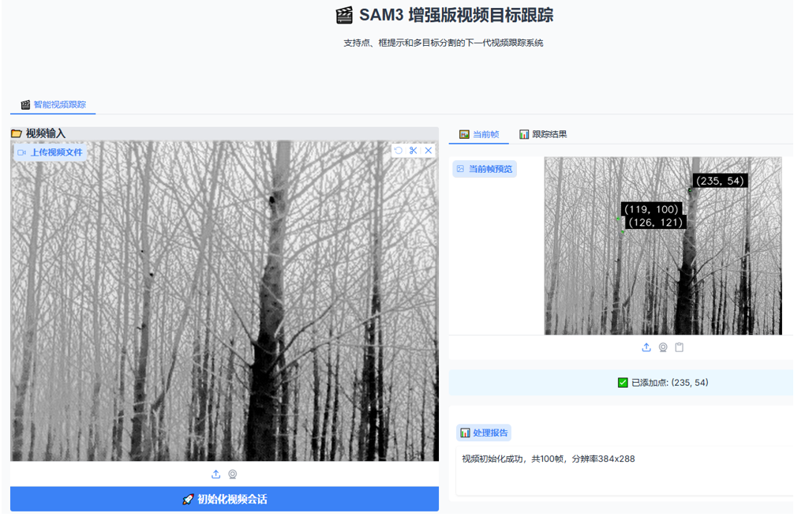

SAM3 Video Tracking & Segmentation with Gradio

A video tracking and segmentation system based on SAM3, supporting point-prompt-based video segmentation. Suitable for both digital image (visible light) label and particularly effective for infrared video segmentation.

基于sam3的视频跟踪分割系统，可用于基于点提示的视频分割，既可以用于数码图像（可见光）标注，也特别适用于红外视频分割。
# Overview
This system leverages SAM3's powerful segmentation generalization capabilities to deliver excellent performance in infrared video segmentation tasks. Since infrared videos lack color informationwhere SAM3's text-prompt feature underperforms—this implementation specifically utilizes point-prompt annotation to fully harness SAM3's potential.

借助于sam3强大的分割泛化能力，本系统在红外视频分割中有很好的效果。同时，红外无颜色信息，使用sam3的文本提示效果不佳，故这里特开发基于点提示标注，从而充分发挥sam3的能力。

# Note
This project contains only a single code file(sam3_video_main.py),for the remaining code, please refer to sam3-gradio/[https://github.com/Pytorchlover/sam3-gradio].
# Key Features
- Dual-Mode Support: Excellent performance for both visible-light and infrared video segmentation
- Infrared-Optimized: Specialized point-prompt labeling for infrared video, addressing the limitations of text prompts in colorless environments
- Result Export: Supports downloading labeled masks and comparative video results
- User-Friendly Interface: Built with Gradio for accessible interaction
# Prerequisites
Refer to Acknowledgments for foundational dependencies and setup requirements.
# Installation
Clone the repository
git clone https://github.com/buwangchuxin199/sam3-video-gradio.git
cd sam3-video-gradio

# Usage
run python3 sam3_video_main.py
- Open your browser and navigate to the provided local URL (typically http://localhost:7860) to access the Gradio interface.
- Upload your video (visible or infrared)
- Add point prompts on objects of interest
- Let SAM3 process the segmentation
- Download the resulting masks or annotated videos
# Acknowledgments
This project builds largerly upon the excellent work from sam3-gradio(https://github.com/Pytorchlover/sam3-gradio). We are grateful for the foundational implementation and resources provided by the original authors.
# License
No
